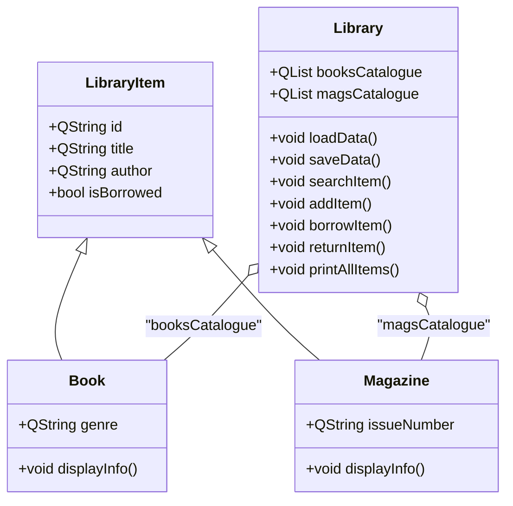

# Assignment 1 Library Management System

```
    _______
   /      /,
  /      //
 /______//
(______(/
```

## Overview
A simple console-based Library Management System written in C++ using Qt for JSON handling. Users can perform basic operations:
- **Search** for Books or Magazines by title, author, or ID
- **Add** new items to the catalogue
- **Borrow** and **Return** items, with borrowing state saved to JSON
- **Print** all items, displaying the full books and magazines catalogues

## Project Structure
```plaintext
main.cpp          # Entry point: displays menu and dispatches commands
library.h/.cpp    # Library class: manages collections, JSON persistence, and printing
libraryitem.h/.cpp# Base class: common fields (id, title, author, isBorrowed)
book.h/.cpp       # Book class: adds 'genre'
magazine.h/.cpp   # Magazine class: adds 'issueNumber'
library_resources.qrc # Qt resource file embedding initial JSON
library_data.json # Persistent storage of items outside the app
```

## Class Diagram


## Workflow
1. **Startup**: Qt resource `library_resources.qrc` provides initial `library_data.json`; `main.cpp` instantiates `Library` and calls `loadData()`
2. **User Menu**: choose operation (Search, Add, Borrow, Return, Print All, Exit)
3. **Operations**: Library methods update in-memory data and call `saveData()` to persist changes
4. **Print All**: `printAllItems()` displays books and magazines catalogues
5. **Exit**: all changes already saved in JSON; app quits

## JSON Schema
```json
[
  {
    "id": "12345-X",
    "title": "Example Title",
    "author": "Author Name",
    "genre": "Fiction",
    "issue": 10,
    "issueNumber": "2025-04",
    "isBorrowed": false
  }
]
```

# Library Management System (Qt Widgets)

A simple Qt Widgets application for managing a small library of Books and Magazines. It uses:
- QMainWindow + QWidget layouts (QVBoxLayout, QHBoxLayout, QFormLayout)
- QTableView with QStandardItemModel + QSortFilterProxyModel for sorting and filtering
- Auto-generated IDs for new items
- LibraryUtils helpers (persistence, sorting/searching, generic Storage<T>)

## Features
- Single Add form for Book/Magazine with dynamic "extra" field (Genre or Issue #)
- Search box (live filter across all columns)
- Borrow/Return actions (buttons enable/disable based on selection state)
- Sort by clicking table headers
- Data persisted to JSON via LibraryUtils

## UI at a glance
- Top row:
  - Search box + Search button (live filter also triggers while typing)
  - Borrow / Return buttons (work on the currently selected row)
- Middle:
  - Table showing Type, ID, Title, Author, Extra (Genre/Issue #), Borrowed
- Bottom:
  - Add form with Type (Book/Magazine), Title, Author, and an extra field:
    - Book: Genre (text)
    - Magazine: Issue # (number)
  - Add button (IDs are auto-generated; no ID input field)

## Auto-generated IDs
- IDs are created automatically when adding an item.
- Generation is handled in Library (e.g., Library::generateUniqueId) to ensure uniqueness across Books and Magazines.

## Sorting and filtering
- Sorting: Click any table header to sort ascending/descending.
- Filtering: The search box applies a case-insensitive filter across all columns using QSortFilterProxyModel.

## Build and run

### Prerequisites
- Qt 6.x with MinGW (or MSVC) toolchain installed
- qmake + make on PATH, or use the provided VS Code tasks

### VS Code (recommended)
- Use the tasks provided in .vscode:
  - Build: "Build Qt Project (cmd)" (runs qmake + mingw32-make under cmd.exe)
  - Run: "Run Qt Application" (sets PATH so Qt/MinGW DLLs are found)
  - If linking fails with Permission denied: run "Kill App" then build again

### Command line (manual)
- PowerShell (no &&):
  - cd E:\Dummy Repos\2Uni\cos2614\ass1Library
  - "D:\Qt\6.8.2\mingw_64\bin\qmake.exe" ass1Library.pro
  - "D:\Qt\Tools\mingw1310_64\bin\mingw32-make.exe"
- cmd.exe (supports &&):
  - cd /d E:\Dummy Repos\2Uni\cos2614\ass1Library
  - "D:\Qt\6.8.2\mingw_64\bin\qmake.exe" ass1Library.pro && "D:\Qt\Tools\mingw1310_64\bin\mingw32-make.exe"

## Project layout (high level)
- ass1Library/ (app)
  - main.cpp
  - mainwindow.h/.cpp (UI)
  - library.h/.cpp, book.h/.cpp, magazine.h/.cpp
  - ass1Library.pro
- LibraryUtils/ (utility library)
  - include/LibraryUtils/... (headers)
  - src/... (sources)
  - Storage/Storage.h (header-only template container)

## Storage<T> quick use
- Header-only template for managing collections of LibraryItem-derived types.
- Common ops: add, removeById, findById, findAll (predicate), containsId, size, clear.

## Troubleshooting
- PowerShell error "&& is not a valid statement separator":
  - Use the provided VS Code tasks (they run under cmd.exe), or run commands sequentially in PowerShell as shown above.
- Link error "cannot open output file ... Permission denied":
  - The EXE is still running. Close it or run the "Kill App" task, then rebuild.
- Runtime error -1073741515 (0xC0000135 or missing DLL):
  - Run via the "Run Qt Application" task (it sets PATH for Qt/MinGW DLLs).

## Notes
- The table is view-only; edits are made via the Add/Borrow/Return actions.
- Search filters the view only; to clear, empty the search box.
- LibraryUtils can be linked as a static library or compiled directly into the app (fallback in pro file).
