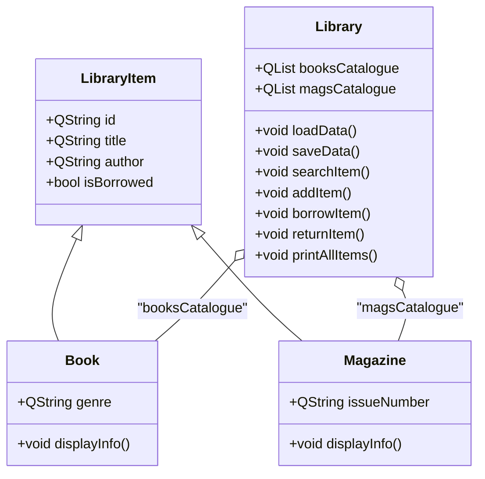

# Assignment 1 Library Management System

```
    _______
   /      /,
  /      //
 /______//
(______(/
```

## Overview
A simple console-based Library Management System written in C++ using Qt for JSON handling. Users can perform basic operations:
- **Search** for Books or Magazines by title, author, or ID
- **Add** new items to the catalogue
- **Borrow** and **Return** items, with borrowing state saved to JSON
- **Print** all items, displaying the full books and magazines catalogues

## Project Structure
```plaintext
main.cpp          # Entry point: displays menu and dispatches commands
library.h/.cpp    # Library class: manages collections, JSON persistence, and printing
libraryitem.h/.cpp# Base class: common fields (id, title, author, isBorrowed)
book.h/.cpp       # Book class: adds 'genre'
magazine.h/.cpp   # Magazine class: adds 'issueNumber'
library_resources.qrc # Qt resource file embedding initial JSON
library_data.json # Persistent storage of items outside the app
```

## Class Diagram


## Workflow
1. **Startup**: Qt resource `library_resources.qrc` provides initial `library_data.json`; `main.cpp` instantiates `Library` and calls `loadData()`
2. **User Menu**: choose operation (Search, Add, Borrow, Return, Print All, Exit)
3. **Operations**: Library methods update in-memory data and call `saveData()` to persist changes
4. **Print All**: `printAllItems()` displays books and magazines catalogues
5. **Exit**: all changes already saved in JSON; app quits

## JSON Schema
```json
[
  {
    "id": "12345-X",
    "title": "Example Title",
    "author": "Author Name",
    "genre": "Fiction",
    "issue": 10,
    "issueNumber": "2025-04",
    "isBorrowed": false
  }
]
```
